# 📋 TaskManager – Personal Task Tracking App (Flutter + Firebase)

**TaskManager** is a feature-rich, modern task management app built with **Flutter**, **Firebase**, and **Riverpod**. Designed with clean architecture and scalable code, it offers real-time task tracking, authentication, and task filtering—ideal for both productivity and as a demonstration of professional Flutter/Firebase development practices.

---

## 🚀 Key Features

- 🔐 **Secure User Login** – Email & password authentication via Firebase
- 📋 **Personal Task Storage** – Each user's data is isolated and private
- ➕ **Create, Edit & Delete Tasks** – Full CRUD functionality
- ✅ **Toggle Task Completion** – Mark tasks as done or undone
- 🔍 **Advanced Filters** – Filter tasks by:
  - Priority (High, Medium, Low)
  - Status (Completed, Incomplete)
  - Tags
- ♻️ **Real-Time UI Updates** – Powered by `AsyncNotifier` from Riverpod
- 🔒 **Firestore Security Rules** – User data is safely restricted

---

## 🧑‍💻 Technologies Used

| Tech | Description |
|------|-------------|
| Flutter | Cross-platform UI toolkit |
| Firebase Auth | Authentication backend |
| Cloud Firestore | Realtime NoSQL database |
| Riverpod | State management with AsyncNotifier |
| Tuple | Lightweight data structure for filters |

---

## 📁 Project Structure

lib/
├── models/
│ └── TaskModel.dart # Data model
├── repository/
│ └── TaskRepository.dart # Firestore interaction layer
├── provider/
│ └── TaskProvider.dart # Riverpod logic (AsyncNotifier)
├── screens/
│ ├── LoginScreen.dart
│ └── HomeScreen.dart
└── main.dart # App entry point

## 🎥 Demo

[Click here to view demo video]( https://drive.google.com/file/d/1vXiVuhIMNX4u6zVLZmVc9ZKzLOlvgyXC/view?usp=sharing )

*👉 A full walkthrough showing login, task creation, filtering, and completion features.*

---

## 📸 Screenshots

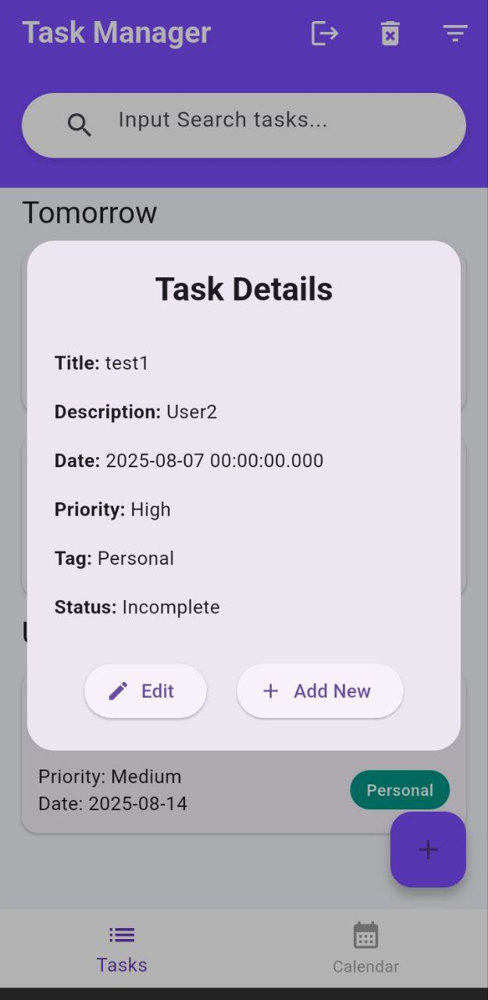

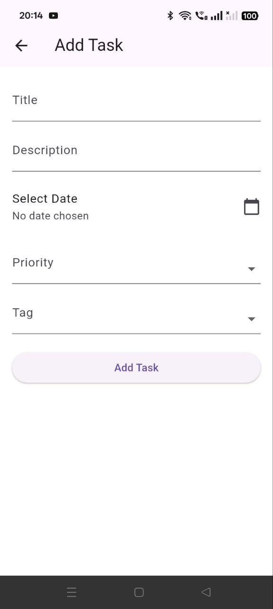

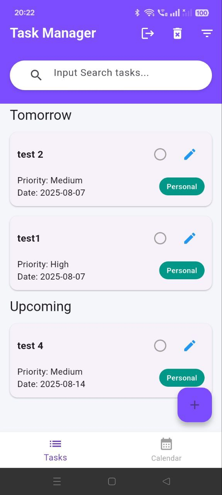

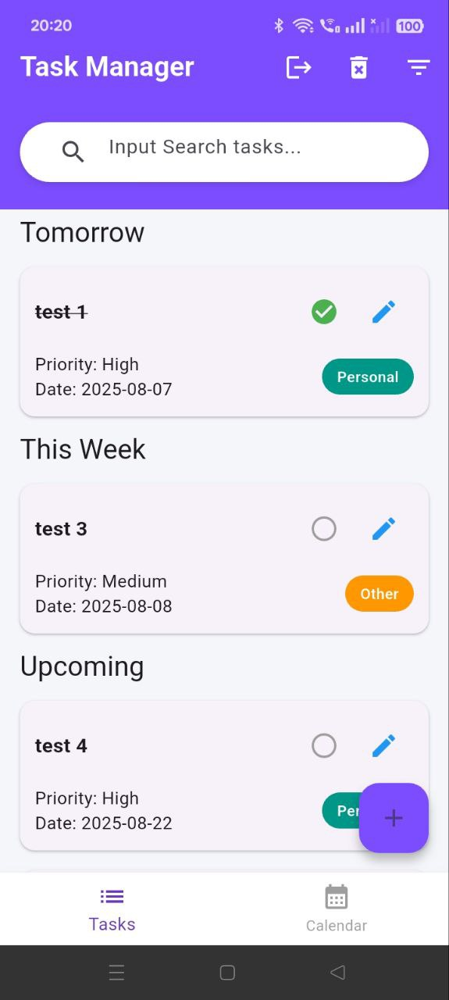

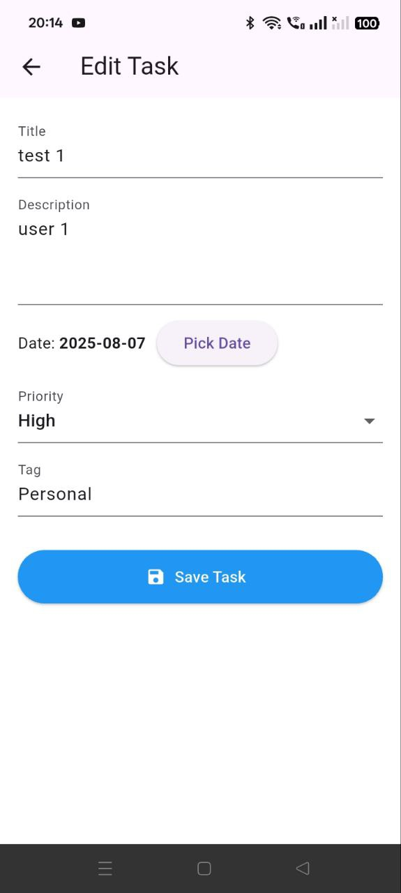

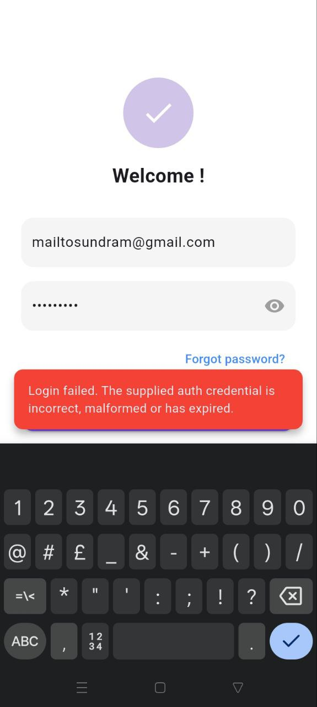

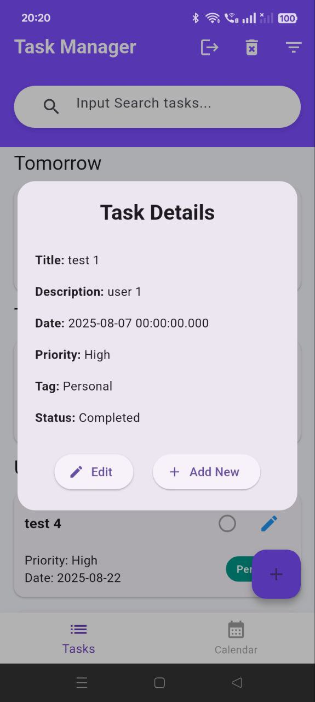

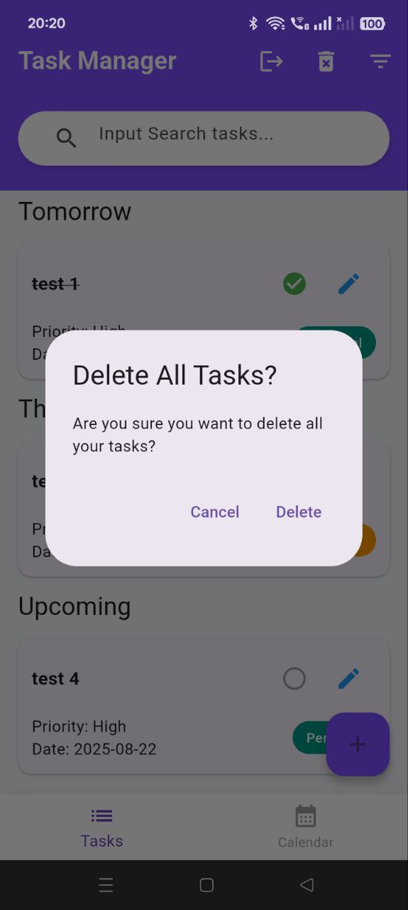

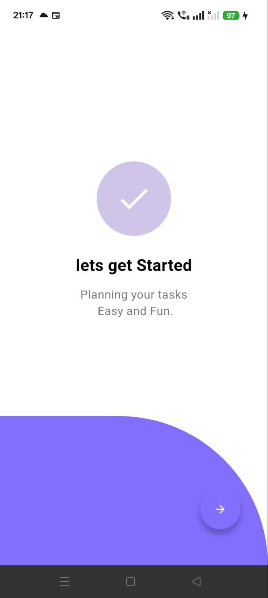

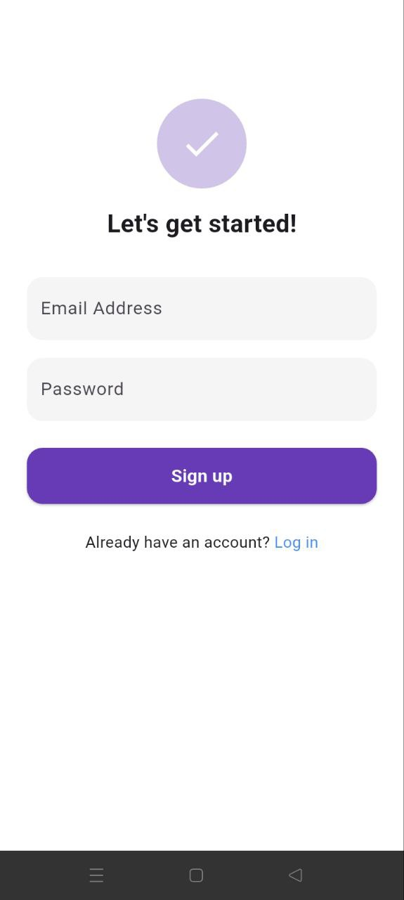

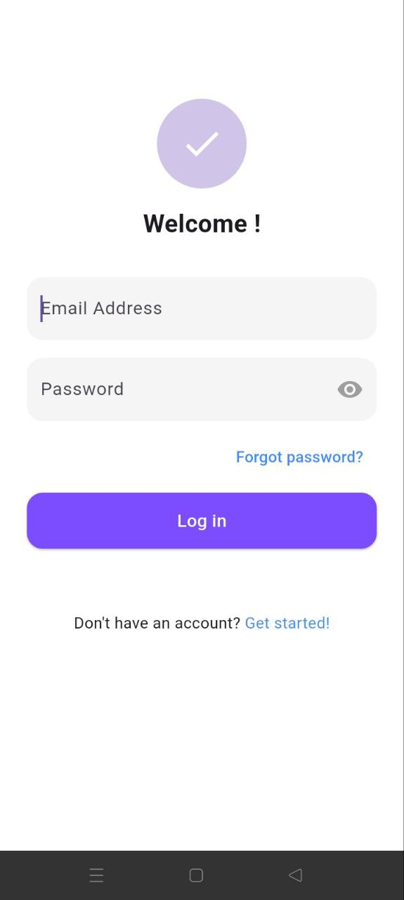

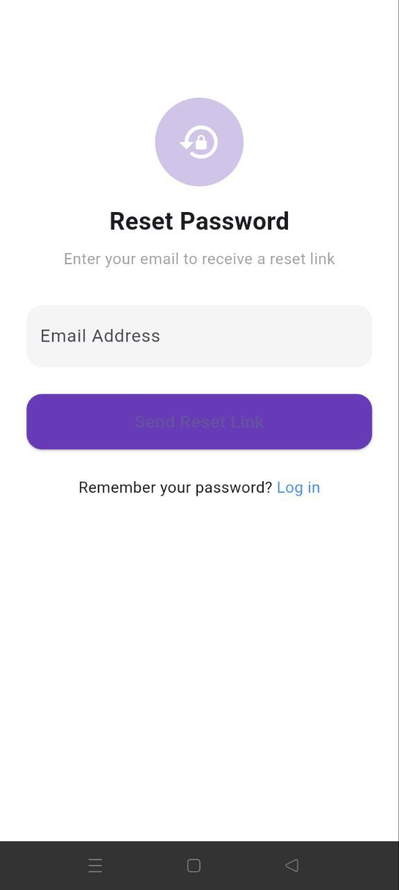

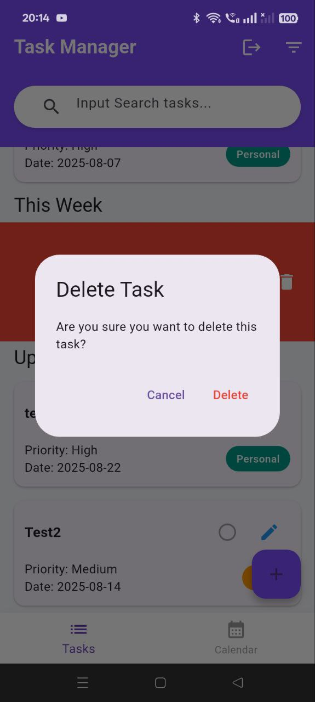

✨ Future Enhancements
📅 Add due dates and calendar views

🔔 Push notifications for reminders

📊 Task analytics dashboard

🔎 Global search functionality

🌙 Dark mode support

🧑 Author
Sundram Awasthi
📧 [sundramjob@gmail.com]

📌 This project was created as part of a job/internship evaluation to demonstrate Flutter app development skills, clean architecture, and real-world Firebase integration.

